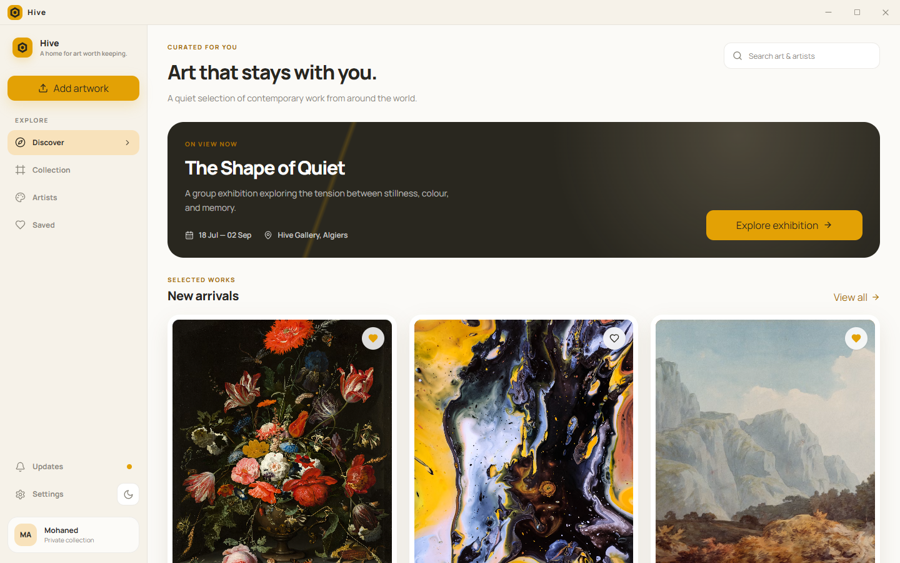

<h1 style="font-family: Arial, sans-serif; font-size: 36px; color: #7C5CFC; display: flex; align-items: center; gap: 12px; border-bottom: 3px solid #7C5CFC; padding-bottom: 8px;">
  Hive — Private Art Collection
</h1>

Hive is a local-first desktop gallery for discovering, organizing, and saving contemporary artwork. It is built with **Tauri, React, TypeScript, Tailwind CSS, and SQLite**.

---

## Tech Used


---

## Features

- Curated discovery view with featured exhibitions and new arrivals
- Browseable collection, artists, and saved-artwork views
- Artwork search and save actions
- Light and dark visual themes
- Custom desktop titlebar with native window controls
- Local SQLite database preloaded as `hive.db`
- Native integrations for dialogs, files, notifications, storage, logging, clipboard, HTTP, and window-state restoration

---

## Screenshots



**Discover:** Featured exhibition, artwork search, and a curated selection of new arrivals.

---

## Project Structure

```text
src/
|-- components/             # Gallery cards, layout, titlebar, and UI primitives
|-- config/                 # App and route configuration
|-- data/                   # Artwork and artist data
|-- hooks/                  # Gallery state, theme, and window controls
|-- pages/                  # Discover, Collection, Artists, Saved, Settings
|-- router/                 # Hash-router configuration
|-- sections/               # Composed gallery sections
|-- styles/                 # Global Tailwind styling
|-- types/                  # Shared gallery types
|-- App.tsx                 # Application shell
`-- main.tsx                # React entry point

src-tauri/
|-- src/                    # Rust application entry point
|-- capabilities/           # Tauri permission definitions
|-- tauri.conf.json         # Window, build, SQLite, and bundle configuration
`-- Cargo.toml              # Rust dependencies
```

---

## Getting Started

### Prerequisites

- Node.js 18+
- pnpm
- Rust toolchain
- Tauri system dependencies for your operating system

### Install dependencies

```bash
pnpm install
```

### Run in the browser

```bash
pnpm dev
```

The Vite server is configured for `http://localhost:61427`.

### Run the desktop app

```bash
pnpm tauri dev
```

---

## Available Scripts

```bash
pnpm dev          # Start Vite
pnpm build        # Type-check and build frontend assets
pnpm typecheck    # Run TypeScript checking
pnpm rust:check   # Check the Rust/Tauri application
pnpm preview      # Preview the production frontend build
pnpm tauri dev    # Run the desktop app
```

---

## Core Pages

- `#/` — Discover
- `#/collection` — Artwork collection
- `#/artists` — Artist directory
- `#/saved` — Saved artwork
- `#/settings` — Gallery settings
