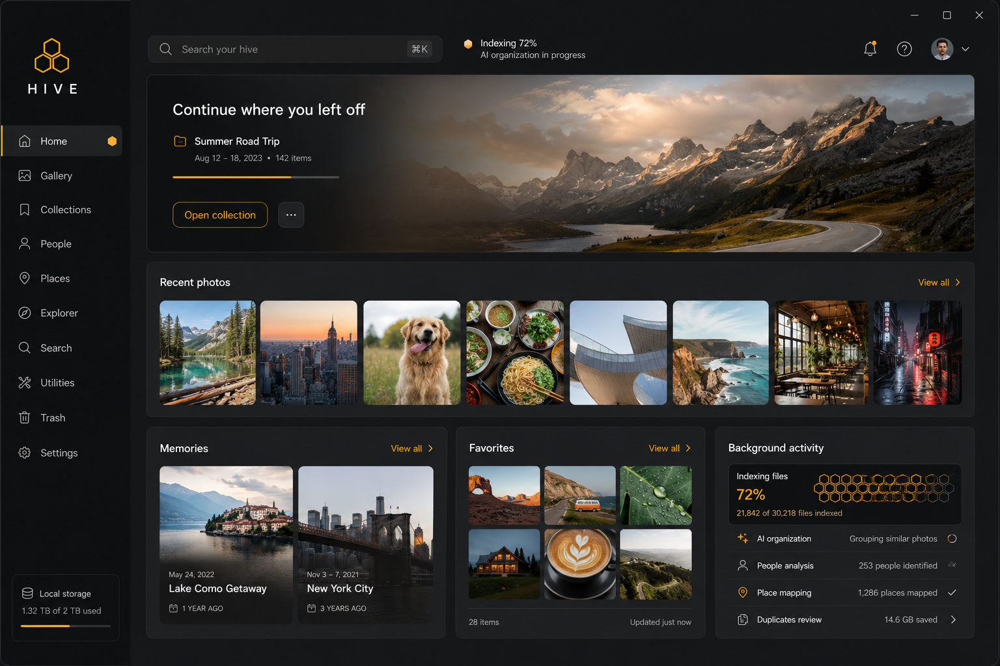
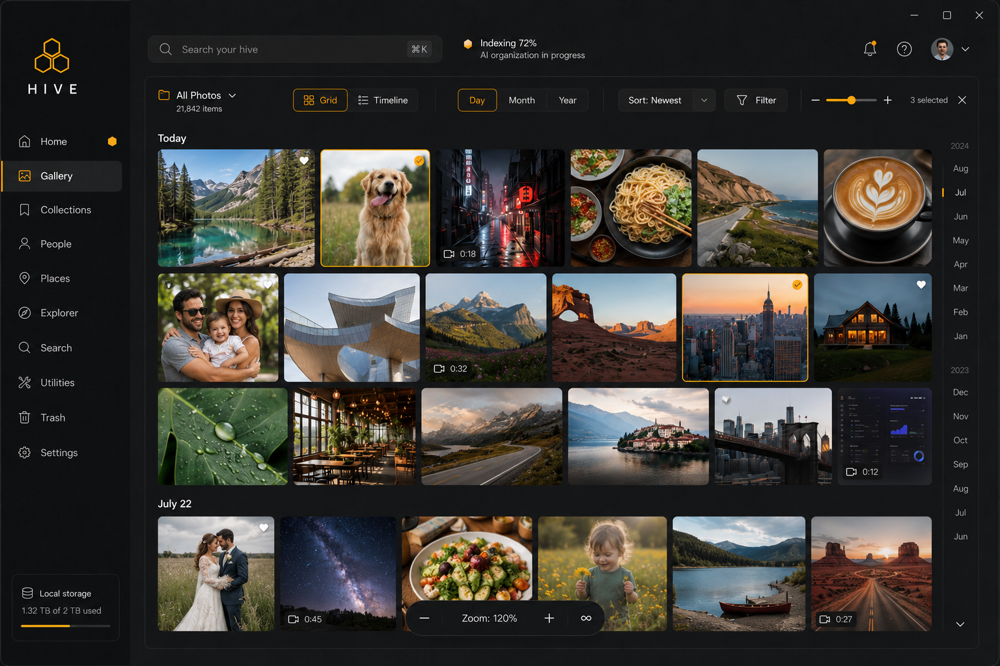
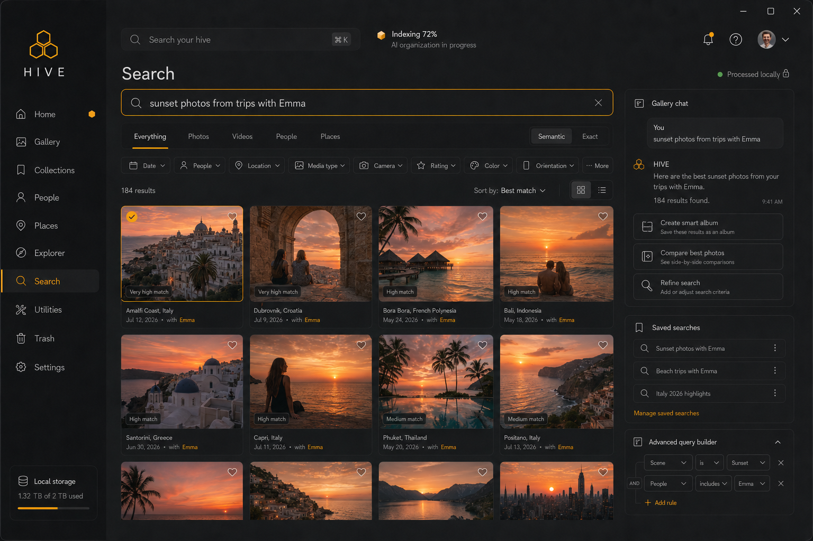
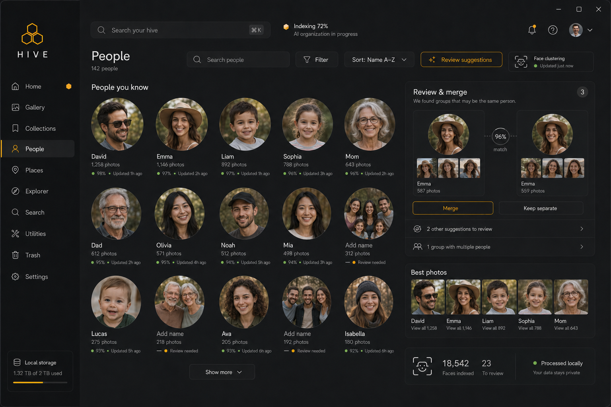
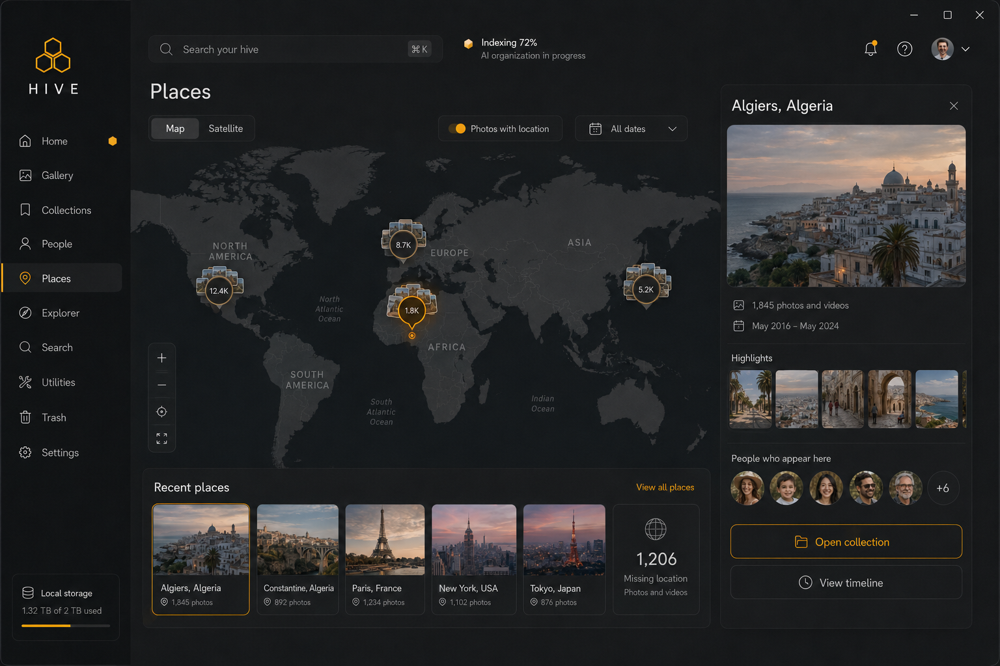
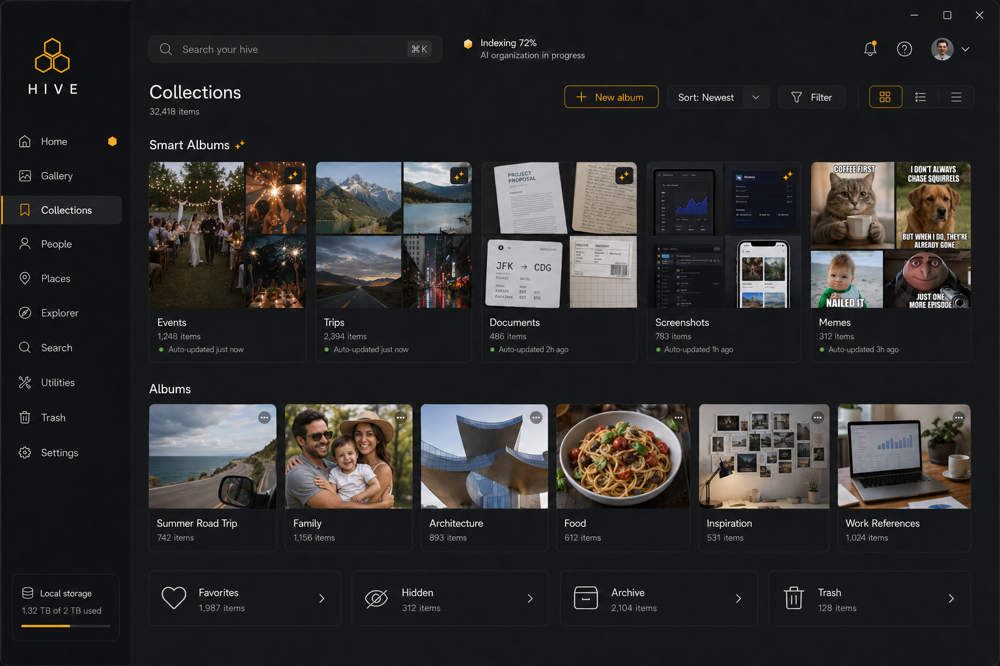
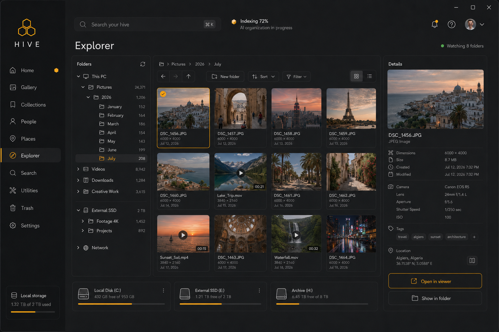

<h1 style="font-family: Arial, sans-serif; font-size: 36px; color: #7C5CFC; display: flex; align-items: center; gap: 12px; border-bottom: 3px solid #7C5CFC; padding-bottom: 8px;">
  Hive — Local-First Photo Library
</h1>

Hive is a local-first desktop photo library and gallery manager. It indexes photos and videos from
folders you choose, and layers on-device AI (face recognition, semantic search, duplicate
detection, OCR, and a gallery chat assistant) on top — all without uploading anything to the cloud.
Built with **Tauri, React, TypeScript, Tailwind CSS, SQLite, and a local ONNX/Candle ML stack**.

---

## Tech Used


---

## Features

- **Gallery & Timeline** — paginated grid view with live indexing progress, folder filters, and an
  undated-photos bucket
- **Viewer** — zoom/pan/rotate, slideshow, filmstrip, info drawer, context menu
- **Search** — exact search (SQLite FTS5 over filename/camera/OCR text) and semantic search
  (CLIP ViT-B/32 text-to-image), with a gallery chat panel alongside results
- **People** — on-device face detection (UltraFace) and recognition (ArcFace) with incremental
  clustering, rename, and a per-person photo grid
- **Places** — GPS-clustered map view with zoom/pan/fullscreen and optional reverse-geocoded place
  names, shown even before any photos are geotagged
- **Collections** — manual albums plus rule-based smart views (favorites, hidden, archive) and
  auto-groups (timeline events, trips)
- **Duplicate detection** — perceptual-hash + union-find clustering to surface near-duplicate photos
- **Editor** — crop, rotate, filters, exposure/color adjustment, and metadata editing
- **Utilities** — storage analyzer, library health scan, blur detection, batch rename/convert/compress,
  export, and backup/restore
- **Trash** — restore, permanently delete, or empty
- **Gallery chat** — a local LLM (Qwen2.5-1.5B-Instruct GGUF via `candle`, pure Rust) answers questions
  grounded in retrieved photo metadata (filename, date, camera, OCR text)
- **Explorer** — a real drive/folder browser to pick and watch folders, with incremental reindexing on
  file changes
- All AI models (CLIP, OCR, faces, chat LLM — roughly 150MB/96MB/67MB/1.1GB) are off by default and
  downloaded on demand from Settings; everything runs fully offline once downloaded

---

## Screenshots



**Home:** Recents, favorites, "on this day", and continue-viewing rails with live library stats.



**Gallery:** Paginated photo/video grid with folder filters and live indexing progress.



**Search:** Exact and semantic (CLIP) search with filters and a gallery chat panel.



**People:** Face clusters with rename and a per-person photo grid.



**Places:** GPS-clustered map view of where photos were taken.



**Collections:** Manual albums and rule-based smart views.



**Explorer:** Real drive/folder browser for picking and watching folders.

---

## Project Structure

```text
src/
|-- components/             # brand, chat, collections, duplicates, editor, layout, media,
|                            # projects, search, settings, tasks, utilities, ui primitives
|-- pages/                  # Home, Gallery, Viewer, Search, Collections, People, Places,
|                            # Explorer, Utilities, Trash, Settings, Editor, Album detail
|-- hooks/                  # gallery state, theme, window controls
|-- App.tsx                 # Application shell
`-- main.tsx                # React entry point

src-tauri/
|-- src/
|   |-- ai/                 # CLIP, faces, OCR, chat LLM commands
|   |-- commands/           # Tauri command handlers
|   |-- db.rs               # SQLite (rusqlite, WAL) schema/access
|   |-- duplicates.rs        # perceptual-hash duplicate clustering
|   |-- indexing.rs          # file hashing, EXIF, phash indexing
|   |-- jobs.rs              # background job queue + progress events
|   |-- thumbnails.rs        # image/video thumbnail generation
|   `-- watcher.rs           # per-folder file watcher, incremental reindex
|-- capabilities/           # Tauri permission definitions
`-- Cargo.toml               # Rust dependencies (rusqlite, ort, candle, image, kamadak-exif, ...)
```

---

## Getting Started

### Prerequisites

- Node.js 18+
- pnpm
- Rust toolchain
- Tauri system dependencies for your operating system
- `ffmpeg` on PATH (optional — enables video thumbnails; without it Hive falls back to a
  placeholder icon)

### Install and run

```bash
pnpm install
pnpm tauri dev
```

### Available Scripts

```bash
pnpm dev          # Start Vite
pnpm build        # Type-check and build frontend assets
pnpm typecheck    # Run TypeScript checking
pnpm rust:check   # Check the Rust/Tauri application
pnpm preview      # Preview the production frontend build
pnpm tauri dev    # Run the desktop app
```

---

## Data & Local AI

- Hive preloads a local SQLite database (`hive.db`) via `tauri-plugin-sql`.
- Every AI feature (semantic search, face recognition, duplicate detection, OCR, gallery chat) runs
  on-device — no photos or metadata leave the machine.
- The Rust backend (`ort` for ONNX, `candle` for the chat LLM) does the real work; the frontend is a
  thin, reactive view over background jobs and SQLite queries.

## Current Status

Actively developed, not yet at a tagged release (`0.1.0`). Core library management (indexing,
search, people, places, collections, duplicates, editor, utilities, trash) is functional end to end.
The main known gap is Rania's original AI wishlist — auto-tagging, image captions, best-photo
selection, aesthetic ranking, and sensitive-content detection are not built yet; event/trip
clustering and blur detection are done without needing an ML model for them.
